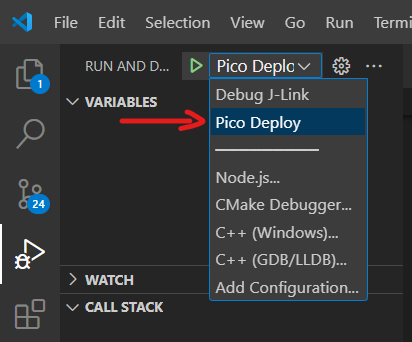

# Healbot FW - SANDBOX
Welcome to Healbot FW - a modular Embedded Firmware creation repository for the Social Robotics project.

## Overview
This repository serves as a sandbox for the development of Healbot FW, aimed at eventual transformation into a library. Currently, it contains a collection of code modules crafted by the S6 2324-group. Due to time constraints in development capacity and concerns regarding maintainability, this repository is designated as a sandbox environment.

# Code Quality
It's important to note that the current codebase is a work in progress and may not yet meet optimal standards. Developed at Technical Readiness Level 3, the project aimed to explore various proof of concepts while ensuring core functionality in a multi-disciplined and scrum-based environment. While industry best practices and standards are applied by the experienced developers involved, they may not be consistently implemented throughout the codebase.

## Known Issues 
The following things are known to be an issue: 
- [ ] Trying to play too many animations shortly after each other. The cause is to be suspect overload of LVGL object creation in the display buffer. 
- [ ] Retriggering the stepmotors before they are done with the previous movements, leads to hardfault. The cause is due to driver tries to another callback which is already active and so it will lead to a assert in the Pico SDK.
- [ ] Command Skipping after third. This is not really an issue but a limitation of the buffer in the Async UART, which can save 3 incoming lines with the header ending: \r\n. 

# Getting Started
1. Clone the repository. 
2. Connect the Hardware correctly. 

If you want to debug/flash remotely run the "Pico Deploy" launch configuration*

***Remote Debugging**: to be able to remote debug (through the RPI4) it is required to start the OpenOCD server on the RPI4 with the correct configuration file, check this [config](docs/universal_connector_board.cfg). To start the OpenOCD server run:

``
openocd -f universal_connector_board.cfg
``

Or the Debug J-Link configuration if you connect a JLink Edu Mini on the PICO headers themselves. 

## Firmware Functional Verification
The Firmware is functional unit tested through isolated function calls and event/action verification with the serial prints, debug register variables checking and/or visual output. The integration is tested using the [DemoDash](https://github.com/HCL-Hbot/Healthbot-DemoDash) application which is a Healthbot manual control GUI.

There are no real validation of the drivers or clean software unit tests performed. Which is recommended for the future development to enhance the system's robustness and maintainability. 

# License
This project is licensed under the Apache License, Version 2.0. See the LICENSE file for details.